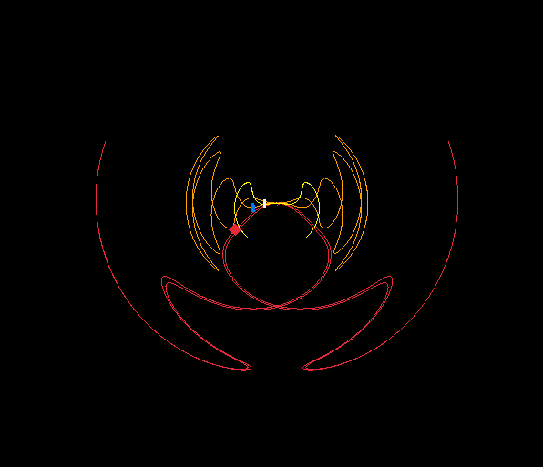

# DOODLE

Doodle is a hobby project about math art which mostly draws , I might write a  on this soon.

https://github.com/user-attachments/assets/62634837-6933-400c-9478-8f4e5f58018f
(MADE USING DOODLE)
```c
theta = (radius) * (cosf(i/2));
theta2 = (radius2) * (cosf(i/4));
theta3 = (radius3) * (cosf(i/8));
```

## QUICK START

Dependencies
- [raylib](https://www.raylib.com/)

### BOOTSTRAP BUILD

You will need to bootstrap the build system for once.

```console
$ gcc nob.c -o nob
```

Next time onwards, just run

```console
$ ./nob && ./main 
```

<div style="display: flex; justify-content: space-around;">
  
</div>
